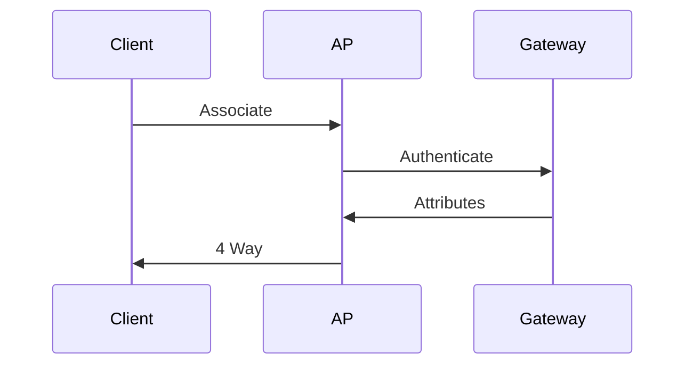
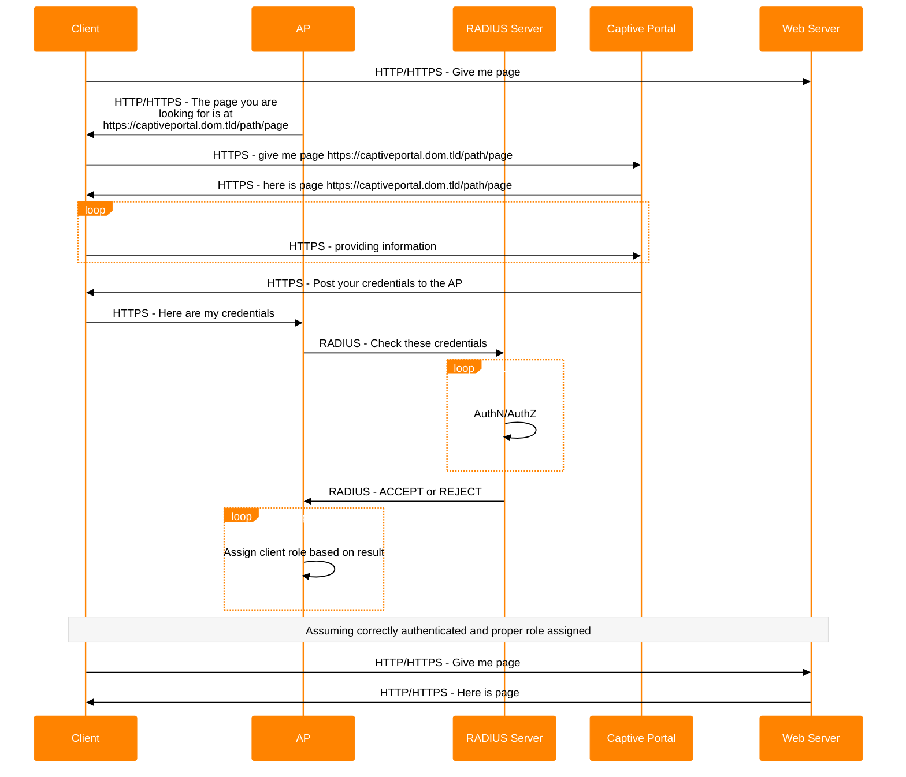

{}
This page is marked as a draft and as such should not be rendered at the server.
{}

Text can be normal, **bold**, _italic_, or ~~strikethrough~~.

[Link to another page](/docs/).

There should be whitespace between paragraphs.

There should be whitespace between paragraphs.


Text can be normal, **bold**, _italic_, or ~~strikethrough~~.

[Link to another page](/docs/).

[Link to another page using relref]()

There should be whitespace between paragraphs.

There should be whitespace between paragraphs.


## Headings in the document start at header 2

This is a normal paragraph following a header. GitHub is a code hosting platform for version control and collaboration. It lets you and others work together on projects from anywhere.

### Header 3

> This is a blockquote following a header.
>
> When something is important enough, you do it even if the odds are not in your favor.


> This is a blockquote following a header.
>
> When something is important enough, you do it even if the odds are not in your favor.


#### Header 4

Lorem ipsum dolor sit amet, consectetur adipiscing elit, sed do eiusmod tempor incididunt ut labore et dolore magna aliqua. Ut enim ad minim veniam, quis nostrud exercitation ullamco laboris nisi ut aliquip ex ea commodo consequat. Duis aute irure dolor in reprehenderit in voluptate velit esse cillum dolore eu fugiat nulla pariatur. Excepteur sint occaecat cupidatat non proident, sunt in culpa qui officia deserunt mollit anim id est laborum.

##### Header 5

Lorem ipsum dolor sit amet, consectetur adipiscing elit, sed do eiusmod tempor incididunt ut labore et dolore magna aliqua. Ut enim ad minim veniam, quis nostrud exercitation ullamco laboris nisi ut aliquip ex ea commodo consequat. Duis aute irure dolor in reprehenderit in voluptate velit esse cillum dolore eu fugiat nulla pariatur. Excepteur sint occaecat cupidatat non proident, sunt in culpa qui officia deserunt mollit anim id est laborum.

###### Header 6

Lorem ipsum dolor sit amet, consectetur adipiscing elit, sed do eiusmod tempor incididunt ut labore et dolore magna aliqua. Ut enim ad minim veniam, quis nostrud exercitation ullamco laboris nisi ut aliquip ex ea commodo consequat. Duis aute irure dolor in reprehenderit in voluptate velit esse cillum dolore eu fugiat nulla pariatur. Excepteur sint occaecat cupidatat non proident, sunt in culpa qui officia deserunt mollit anim id est laborum.

## Lists

Ordered (numbered) and unordered (bulleted) lists

### Unordered list

- This is an unordered list following a header.

- This is an unordered list following a header.

- This is an unordered list following a header.


- This is an unordered list following a header.

- This is an unordered list following a header.

- This is an unordered list following a header.


### Ordered list

1. This is an ordered list following a header.

2. This is an ordered list following a header.

3. This is an ordered list following a header.

An ordered list without specifying the ordinals, allowing automatic renumbering:

1. Item one

1. Item two

1. Item three

1. Item four


1. This is an ordered list following a header.

2. This is an ordered list following a header.

3. This is an ordered list following a header.

An ordered list without specifying the ordinals, allowing automatic renumbering:

1. Item one

1. Item two

1. Item three

1. Item four


### Ordered list, continued

{}
Not available or working currently.
{}

1. Item one
1. Item two

Some text

1. Item three
1. Item four
{style="counter-reset:none;"}

An ordered list starting from 42:

{style="counter-reset:step-counter 41"}

1. Item 42
1. Item 43
1. Item 44

### And a multi-level/nested list

- level 1 item

  - level 2 item

  - level 2 item

    - level 3 item

    - level 3 item

- level 1 item

  - level 2 item

  - level 2 item

  - level 2 item

- level 1 item

  - level 2 item

  - level 2 item

- level 1 item


- level 1 item

  - level 2 item

  - level 2 item

    - level 3 item

    - level 3 item

- level 1 item

  - level 2 item

  - level 2 item

  - level 2 item

- level 1 item

  - level 2 item

  - level 2 item

- level 1 item


### Nesting an ol in ul

Nesting of mixed lists types only goes one deep

- level 1 item (ul)

  1. level 2 item (ol)

  1. level 2 item (ol)

- level 1 item (ul)

  1. level 2 item (ol)

  1. level 2 item (ol)

- level 1 item (ul)

  1. level 2 item (ol)

  1. level 2 item (ol)


- level 1 item (ul)

  1. level 2 item (ol)

  1. level 2 item (ol)

- level 1 item (ul)

  1. level 2 item (ol)

  1. level 2 item (ol)

- level 1 item (ul)

  1. level 2 item (ol)

  1. level 2 item (ol)


### And a task list

- [ ] Hello, this is a TODO item

- [ ] Hello, this is another TODO item

- [x] Goodbye, this item is done


- [ ] Hello, this is a TODO item

- [ ] Hello, this is another TODO item

- [x] Goodbye, this item is done


### Nesting task lists

- [ ] level 1 item (task)

  - [ ] level 2 item (task)

  - [ ] level 2 item (task)

- [ ] level 1 item (task)

- [ ] level 1 item (task)


- [ ] level 1 item (task)

  - [ ] level 2 item (task)

  - [ ] level 2 item (task)

- [ ] level 1 item (task)

- [ ] level 1 item (task)


### Nesting a ul in a task list

- [ ] level 1 item (task)

  - level 2 item (ul)

  - level 2 item (ul)

- [ ] level 1 item (task)

- [ ] level 1 item (task)


- [ ] level 1 item (task)

  - level 2 item (ul)

  - level 2 item (ul)

- [ ] level 1 item (task)

- [ ] level 1 item (task)


### Nesting a task list in a ul

- level 1 item (ul)

  - [ ] level 2 item (task)

  - [ ] level 2 item (task)

- level 1 item (ul)

- level 1 item (ul)


- level 1 item (ul)

  - [ ] level 2 item (task)

  - [ ] level 2 item (task)

- level 1 item (ul)

- level 1 item (ul)


## Overflow behaviors

[This is a very long link (Lorem ipsum dolor sit amet, consectetur adipiscing elit, sed do eiusmod tempor incididunt ut labore et dolore magna aliqua. Ut enim ad minim veniam, quis nostrud exercitation ullamco laboris nisi ut aliquip ex ea commodo consequat.) which wraps and therefore doesn't overflow even when it comes at the beginning](.) of the line.

- [This is a very long link (Lorem ipsum dolor sit amet, consectetur adipiscing elit, sed do eiusmod tempor incididunt ut labore et dolore magna aliqua. Ut enim ad minim
veniam, quis nostrud exercitation ullamco laboris nisi ut aliquip ex ea commodo consequat.) which wraps and therefore doesn't overflow the line when used first in an item](.) in a list.

## Table

| head1        | head two          | three |
|:-------------|:------------------|:------|
| ok           | good swedish fish | nice  |
| out of stock | good and plenty   | nice  |
| ok           | good `oreos`      | hmm   |
| ok           | good `zoute` drop | yumm  |
| unordered lists in cells | <ul><li>HTML</li><li>Required</li></ul> | possible |
| ordered lists in cells | <ol><li>HTML</li><li>Required</li></ol> | possible |


| head1        | head two          | three |
|:-------------|:------------------|:------|
| ok           | good swedish fish | nice  |
| out of stock | good and plenty   | nice  |
| ok           | good `oreos`      | hmm   |
| ok           | good `zoute` drop | yumm  |
| unordered lists in cells | <ul><li>HTML</li><li>Required</li></ul> | possible |
| ordered lists in cells | <ol><li>HTML</li><li>Required</li></ol> | possible |


## There's a horizontal rule below this

* * *


* * *


## Images

Setting a byline requires defining a resource and the byline in the frontmatter

### Small image

{}
Wroclaw University Library digitizing rare archival texts
{}


{}
Wroclaw University Library digitizing rare archival texts
{}


### Large image

{}
Wroclaw University Library digitizing rare archival texts
{}


{}
Wroclaw University Library digitizing rare archival texts
{}


## Callouts

Callouts are enabled by using the `alert` shortcode. The title of a callout is specified in the `title` field of the shortcode, with the color of the shortcode being optional.

```go-html-template
{}
This is a generic callout that uses the specified coloring.
{}
```

{}
This is a generic callout that has color unspecified so uses the primary coloring.
{}

{}
This is a note callout, specifying the `info` color. [Example of a link](#callouts)

```go-html-template
code block for testing
this is inside a callout
interesting results
```
{}

{}
This is a warning callout, specifying the `warning` color. [Example of a link](#callouts)

```go-html-template
code block for testing
this is inside a callout
interesting results
```
{}

{}
This is a danger callout, specifying the `danger` color. [Example of a link](#callouts)

```go-html-template
code block for testing
this is inside a callout
interesting results
```
{}

## Mermaid Diagrams

[Examples of diagrams available with Mermaid - https://mermaid.js.org/syntax/examples.html](https://mermaid.js.org/syntax/examples.html)






## Collapsed Section

The following uses the [`<details>`](https://docs.github.com/en/get-started/writing-on-github/working-with-advanced-formatting/organizing-information-with-collapsed-sections) tag to create a collapsed section.

<details markdown="block">
<summary>Shopping list (click me!)</summary>

This is content inside a `<details>` dropdown.

- [ ] Apples

- [ ] Oranges

- [ ] Milk

</details>


<details markdown="block">
<summary>Shopping list (click me!)</summary>

This is content inside a `<details>` dropdown.

- [ ] Apples

- [ ] Oranges

- [ ] Milk

</details>


## Code Blocks

```js
// Javascript code with syntax highlighting.
var fun = function lang(l) {
  dateformat.i18n = require('./lang/' + l)
  return true;
}
```

```ruby
# Ruby code with syntax highlighting
GitHubPages::Dependencies.gems.each do |gem, version|
  s.add_dependency(gem, "= #{version}")
end
```


```js
// Javascript code with syntax highlighting.
var fun = function lang(l) {
  dateformat.i18n = require('./lang/' + l)
  return true;
}
```

```ruby
# Ruby code with syntax highlighting
GitHubPages::Dependencies.gems.each do |gem, version|
  s.add_dependency(gem, "= #{version}")
end
```


### More code

```python
def dump_args(func):
    "This decorator dumps out the arguments passed to a function before calling it"
    argnames = func.func_code.co_varnames[:func.func_code.co_argcount]
    fname = func.func_name
    def echo_func(*args,**kwargs):
        print fname, ":", ', '.join(
            '%s=%r' % entry
            for entry in zip(argnames,args) + kwargs.items())
        return func(*args, **kwargs)
    return echo_func

@dump_args
def f1(a,b,c):
    print a + b + c

f1(1, 2, 3)

def precondition(precondition, use_conditions=DEFAULT_ON):
    return conditions(precondition, None, use_conditions)

def postcondition(postcondition, use_conditions=DEFAULT_ON):
    return conditions(None, postcondition, use_conditions)

class conditions(object):
    __slots__ = ('__precondition', '__postcondition')

    def __init__(self, pre, post, use_conditions=DEFAULT_ON):
        if not use_conditions:
            pre, post = None, None

        self.__precondition  = pre
        self.__postcondition = post
```

```Text
Long, single-line code blocks should not wrap. They should horizontally scroll if they are too long. This line should be long enough to demonstrate this.
```

An example of `inline code or CLI formatting` within a paragraph, requires using the ` character to open and close the block.
